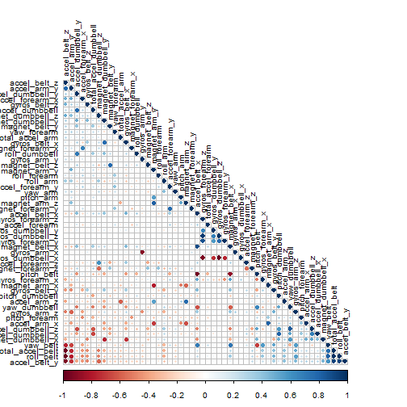

Project for the Practical Machine Learning
========================================================

Data 

The training data for this project are available here: 

https://d396qusza40orc.cloudfront.net/predmachlearn/pml-training.csv

The test data are available here: 

https://d396qusza40orc.cloudfront.net/predmachlearn/pml-testing.csv


```r
library(caret)
```

```
## Loading required package: lattice
## Loading required package: ggplot2
```

```r
library(randomForest,lib.loc="U:/mis/HOPKINS/MACHINE_LEARNING/")
```

```
## Warning: package 'randomForest' was built under R version 3.1.2
```

```
## randomForest 4.6-10
## Type rfNews() to see new features/changes/bug fixes.
```

```r
library(corrplot,lib.loc="U:/mis/HOPKINS/MACHINE_LEARNING/")
```

```
## Warning: package 'corrplot' was built under R version 3.1.2
```

```r
data_training <- read.csv("U:/mis/HOPKINS/MACHINE_LEARNING/pml-training.csv", na.strings= c("NA",""," "))

data_training_NAs <- apply(data_training, 2, function(x) {sum(is.na(x))})
data_training_clean <- data_training[,which(data_training_NAs == 0)]

# remove identifier columns such as name, timestamps etc
data_training_clean <- data_training_clean[8:length(data_training_clean)]

inTrain <- createDataPartition(y = data_training_clean$classe, p = 0.7, list = FALSE)
training <- data_training_clean[inTrain, ]
crossval <- data_training_clean[-inTrain, ]

correlMatrix <- cor(training[, -length(training)])
#correlMatrix
corrplot(correlMatrix, order = "FPC", method = "circle", type = "lower", tl.cex = 0.8,  tl.col = rgb(0, 0, 0))
```

 

```r
# fit a model to predict the classe using everything else as a predictor
model <- randomForest(classe ~ ., data = training)
model
```

```
## 
## Call:
##  randomForest(formula = classe ~ ., data = training) 
##                Type of random forest: classification
##                      Number of trees: 500
## No. of variables tried at each split: 7
## 
##         OOB estimate of  error rate: 0.52%
## Confusion matrix:
##      A    B    C    D    E class.error
## A 3903    2    0    0    1    0.000768
## B   13 2638    7    0    0    0.007524
## C    0   13 2379    4    0    0.007095
## D    0    0   22 2228    2    0.010657
## E    0    0    1    7 2517    0.003168
```

```r
# The model produced a very small OOB error rate of .58%. This was  satisfactory and progress the testing.

# crossvalidate the model using the remaining 30% of data
predictCrossVal <- predict(model, crossval)
confusionMatrix(crossval$classe, predictCrossVal)
```

```
## Warning: package 'e1071' was built under R version 3.1.2
```

```
## Confusion Matrix and Statistics
## 
##           Reference
## Prediction    A    B    C    D    E
##          A 1672    2    0    0    0
##          B    0 1139    0    0    0
##          C    0    6 1020    0    0
##          D    0    0   18  945    1
##          E    0    0    0    0 1082
## 
## Overall Statistics
##                                         
##                Accuracy : 0.995         
##                  95% CI : (0.993, 0.997)
##     No Information Rate : 0.284         
##     P-Value [Acc > NIR] : <2e-16        
##                                         
##                   Kappa : 0.994         
##  Mcnemar's Test P-Value : NA            
## 
## Statistics by Class:
## 
##                      Class: A Class: B Class: C Class: D Class: E
## Sensitivity             1.000    0.993    0.983    1.000    0.999
## Specificity             1.000    1.000    0.999    0.996    1.000
## Pos Pred Value          0.999    1.000    0.994    0.980    1.000
## Neg Pred Value          1.000    0.998    0.996    1.000    1.000
## Prevalence              0.284    0.195    0.176    0.161    0.184
## Detection Rate          0.284    0.194    0.173    0.161    0.184
## Detection Prevalence    0.284    0.194    0.174    0.164    0.184
## Balanced Accuracy       1.000    0.997    0.991    0.998    1.000
```

```r
# apply the same treatment to the final testing data
data_test <- read.csv("U:/mis/HOPKINS/MACHINE_LEARNING/pml-testing.csv", na.strings= c("NA",""," "))
data_test_NAs <- apply(data_test, 2, function(x) {sum(is.na(x))})
data_test_clean <- data_test[,which(data_test_NAs == 0)]
data_test_clean <- data_test_clean[8:length(data_test_clean)]

# predict the classes of the test set
predictTest <- predict(model, data_test_clean)
predictTest
```

```
##  1  2  3  4  5  6  7  8  9 10 11 12 13 14 15 16 17 18 19 20 
##  B  A  B  A  A  E  D  B  A  A  B  C  B  A  E  E  A  B  B  B 
## Levels: A B C D E
```

```r
pml_write_files = function(x){
  n = length(x)
  for(i in 1:n){
    filename = paste0("problem_id_",i,".txt")
    write.table(x[i],file=filename,quote=FALSE,row.names=FALSE,col.names=FALSE)
  }
}

pml_write_files(predictTest)
```
Conclusions
========================================================
With the abundance of information given from multiple measuring instruments it's possible to accurately predict how well a person is preforming an excercise using a relatively simple model. 


